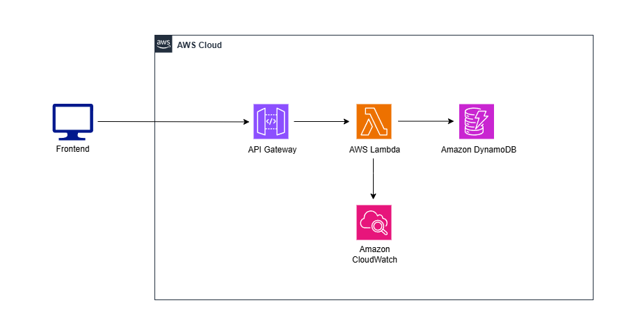

# 無限レコ バックエンド

このリポジトリは、おすすめ投稿アプリ「無限レコ」の**バックエンドAPI**です。  
FastAPI + AWS Lambda + DynamoDBで構築されています。
Serverless Frameworkによりサーバーレス環境へデプロイ可能です。


## 1. 使用技術

| 分類 | 技術 |
|------|------|
| Webフレームワーク | FastAPI |
| データベース | DynamoDB |
| 実行環境 | AWS Lambda（API Gateway） |
| 認証 | JWT（HTTP Only Cookie） + CSRF対応 |
| IaC / デプロイ管理 | Serverless Framework（`serverless.yml`） |

---

## 2. システム構成図（AWS構成）



---

## 3. APIエンドポイント一覧

### 投稿関連
| メソッド     | エンドポイント                         | 概要                 |
| -------- | ------------------------------- | ------------------ |
| `GET`    | `/api/posts`                    | 投稿一覧の取得 |
| `GET`    | `/api/posts/category/{category}`                    | カテゴリごとの投稿一覧の取得 |
| `GET` | `/api/users/{username}/posts`          | ログインユーザーの投稿一覧取得              |
| `GET` | `/api/users/{username}/liked-posts`          | ログインユーザーがいいねした投稿一覧取得              |
| `POST`   | `/api/posts`                    | 新規投稿の作成            |
| `GET`    | `/api/posts/{post_id}`          | 投稿詳細の取得            |
| `PUT`    | `/api/posts/{post_id}`          | 投稿の編集              |
| `DELETE` | `/api/posts/{post_id}`          | 投稿の削除              |

### コメント関連
| メソッド     | エンドポイント                         | 概要                 |
| -------- | ------------------------------- | ------------------ |
| `POST`   | `/api/posts/{post_id}/comments`                 | コメントの追加            |
| `GET`    | `/api/posts/{post_id}/comments` | 投稿のコメント取得          |
| `DELETE`    | `/api/posts/{post_id}/comments/{comment_id}` | 投稿のコメント削除          |

### いいね関連
| メソッド     | エンドポイント                         | 概要                 |
| -------- | ------------------------------- | ------------------ |
| `GET`   | `/api/posts/{post_id}/likes/status`            | ログインユーザーの投稿に対するいいね状態を取得             |
| `POST`   | `/api/posts/{post_id}/like-toggle`            | ログインユーザーの投稿に対するいいね状態を切り替え             |

### カテゴリ関連
| メソッド     | エンドポイント                         | 概要                 |
| -------- | ------------------------------- | ------------------ |
| `GET`   | `/api/categories`            | カテゴリ一覧 を取得            |

### 認証関連
| メソッド     | エンドポイント                         | 概要                 |
| -------- | ------------------------------- | ------------------ |
| `POST`   | `/api/register`            | ユーザー登録             |
| `POST`   | `/api/login`               | ログイン               |
| `POST`   | `/api/logout`              | ログアウト              |
| `POST`   | `/api/user`              | ログインユーザーのusernameを取得              |
| `POST`   | `/api/check-username/{username}`              | ユーザー登録における名前重複チェック              |
| `POST`   | `/api/csrftoken`              | CSRFトークンを取得              |

---

## 4. セキュリティ設計
このアプリでは以下のセキュリティ対策を実装しています。

- **認証・認可**
  - JWT（access_token）によるCookieベース認証を採用
  - ユーザーIDに基づき、新規作成・編集・削除の操作制限を実施

- **CSRF対策**
  - バックエンドでCSRFトークンを発行（`/api/csrftoken`エンドポイント）
  - フロントエンドでCSRFトークンを `X-CSRF-Token` ヘッダーに自動付与
  - バックエンドで照合して検証

- **XSS対策・入力バリデーション**
  - Pydanticによるサーバーサイドバリデーション

- **Cookieのセキュリティ**
  - `Secure` / `HttpOnly` / `SameSite=None` を付与
  - HTTPS環境を前提とした設計

- **JWTの有効期限設定**
  - `access_token`: 15分、`refresh_token`: 今後実装予定

---

## 5. ディレクトリ構成（5〜10行以内）
```
app/
├── main.py                # FastAPIのエントリーポイント（Lambda handler対応）
├── database.py              # DynamoDB操作
├── auth/                  # 認証関連（JWT・Cookie管理など）
│   ├── auth_utils.py
│   └── cookie_utils.py
├── cruds/                  # データベース操作（CRUD関数）
│   ├── crud_category.py
│   ├── crud_comment.py
│   ├── crud_like.py
│   ├── crud_post.py
│   └── crud_user.py
├── routes/                # ルーティング設定（APIRouter）
│   ├── route_auth.py
│   ├── route_category.py
│   ├── route_comment.py
│   ├── route_like.py
│   └── route_post.py
├── schemas/                # Pydanticのスキーマ
│   ├── auth.py
│   ├── category.py
│   ├── comment.py
│   ├── common.py
│   ├── like.py
│   ├── post.py
│   └── user.py
└── services/                  # 投稿情報加工
    └── post_service.py

.env                        # 環境変数ファイル（開発用）
requirements.txt            # Python依存関係
serverless.yml              # Serverless Frameworkの設定
```

---

## 6. DynamoDBの詳細設計

このアプリでは、DynamoDB をシングルテーブル設計で利用し、以下の GSI を設定しています。
| GSI名            | 用途            | パーティションキー                        | ソートキー                               |
| --------------- | ------------- | -------------------------------- | ----------------------------------- |
| `GSI_PostList`  | 全投稿一覧取得（時系列順） | `GSI1_PK`: `POST#ALL`            | `GSI1_SK`: `{created_at}#{post_id}` |
| `GSI_Category`  | カテゴリ別一覧取得     | `GSI2_PK`: `CATEGORY#{category}` | `GSI2_SK`: `{created_at}#{post_id}` |
| `GSI_UserPosts` | ユーザー別投稿一覧取得   | `GSI3_PK`: `USER#{username}`     | `GSI3_SK`: `{created_at}#{post_id}` |
| `GSI_Username`  | ユーザープロフィール取得  | `GSI4_PK`: `USERNAME#{username}` | `GSI4_SK`: `PROFILE`                |
| `GSI_UserLikes` | ユーザーの「いいね」一覧  | `GSI5_PK`: `USER#{username}`     | `GSI5_SK`: `{liked_at}#{post_id}`   |


---

## 7. 今後の予定
- RefreshTokenの実装
- 検索機能（AWSのOpenSearchとの連携）
- テストコードの追加

---

## 8.ローカル開発の手順（WindowsのWSL上で確認済み）
※DynamoDB LocalをDockerコンテナで起動するためWSLが必要

### リポジトリをクローン
```bash
git clone https://github.com/waya-kkazuya/infinite-reco.git
cd infinite-reco
```
### 仮想環境作成（任意）
```bash
python -m venv fastapi_project_env
source fastapi_project_env/bin/activate
```

### 依存パッケージをインストール
```bash
pip install -r requirements.txt
```

### 環境変数を設定
```bash
cp .env.example .env

export JWT_KEY=$(python -c "import secrets; print(secrets.token_urlsafe(32))")
export CSRF_KEY=$(python -c "import secrets; print(secrets.token_urlsafe(32))")
```

### DynamoDB LocalをDockerコンテナで起動
```bash
docker compose up
```

### NoSQL Workbenchを起動してDBデータを確認（任意）
[AWSからダウンロードhttps://docs.aws.amazon.com/ja_jp/amazondynamodb/latest/developerguide/workbench.html](https://docs.aws.amazon.com/ja_jp/amazondynamodb/latest/developerguide/workbench.html)


### 開発サーバー起動
```bash
uvicorn app.main:app --reload --port 8001
```

---

<!-- ## デプロイ手順（Serverless Framework）

### 前提条件
AWS CLIでのIAMユーザーの認証済み

### nvmをインストール（任意）
```bash
インストール
nvm use 20
```

### Serverlessをインストール（初回のみ）
npm install -g serverless


### デプロイ実行
```bash
開発用 npx sls deploy --stage dev --verbose
本番用 npx sls deploy --stage prod --verbose
（※--vervboseはデプロイの詳細表示用）
```

### デプロイ削除
```bash
開発用 npx sls remove --stage dev
本番用 npx sls remove --stage prod
```
--- -->

## 関連リポジトリへのリンク
- [無限レコ 統合ランディングページ](https://github.com/waya-kkazuya/infinite-reco-portfolio)
- [無限レコ フロントエンド](https://github.com/waya-kkazuya/infinite-reco-frontend)

---

## 開発者
- waya
- GitHub: [@waya-kkazuya](https://github.com/waya-kkazuya)
- Xアカウント: https://x.com/waya_dev